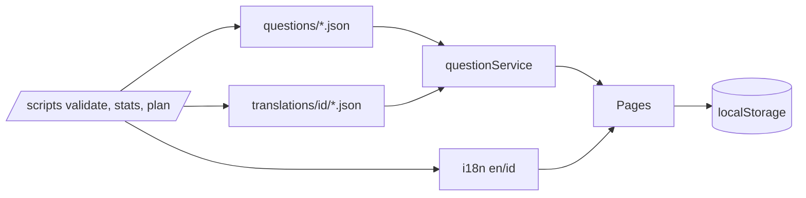

# Implementation Plan – CLF-C02 Practice App

Workspace: `d:\Raffa\AWS\CCP` (currently only `docs/cloud-practitioner-02.pdf`, 624 KB).

## 1. Architecture
- Vite + React 18 + TypeScript + Tailwind CSS + React Router (HashRouter, so it works from any static host or `file`-style hosting).
- No backend. All persistence in `localStorage` behind one typed `storage` module (versioned key `clf02:v1`, with migration hook).
- Questions and translations are static JSON, imported with `import.meta.glob` (eager) and merged at runtime by `questionService`.
- State: React Context + `useReducer` for settings and progress. No Redux or similar.
- Charts: a small hand-written SVG bar chart (no chart dependency).
- Dev-only routes (`/dev/review`) are included only when `import.meta.env.DEV` is true, so they are tree-shaken out of production builds.



## 2. Folder structure
```
/docs/cloud-practitioner-02.pdf
/data-qa/batch-log.md
/scripts/  validate.ts  stats.ts  plan.ts  merge-review.ts  lib/{schema,hash,similarity}.ts
/src/
  data/blueprint.json
  data/questions/d1.json d2.json d3.json d4.json
  data/translations/id/d1.json … d4.json
  i18n/{en.ts,id.ts,index.tsx}      # typed dictionaries, `t(key, params)`
  types/{question.ts,progress.ts}
  lib/{storage,scoring,examBuilder,questionService,hash}.ts
  context/{Settings,Progress}Context.tsx
  components/  Header, LanguageSwitcher, ThemeToggle, QuestionCard, ReviewPanel,
               Timer, QuestionNavigator, DomainChart, Badge, ConfirmDialog, EmptyState
  pages/  Dashboard, PracticeSetup, PracticeSession, ExamSession, Results,
          History, MistakeBank, Browse, Settings, dev/Review
  App.tsx main.tsx index.css
```

## 3. Data schema
Exactly as specified in the prompt (English source, translation file keyed by id).
- `translatedFromVersion` = first 16 hex chars of SHA-256 over canonical JSON of `{question, options, correctOptionIds, explanation, optionExplanations, keyConcept}`. The same function is in `scripts/lib/hash.ts` and `src/lib/hash.ts` (synchronous pure-JS implementation, so both run identically).
- Progress store: `answers[qid] = {attempts:[{ts, selected, correct, mode}]}`, `bookmarks`, `confusing`, `attempts[]` (exam/practice sessions with question ids, selections, flags, score, duration), `streak` (days with ≥1 answer), `settings`.
- Backup JSON: `{app:"clf02", version, exportedAt, data}`. Import validates the shape and offers merge or replace.
- Review-helper notes: `clf02:devReview` → `{[qid]:{verified?, needsReview?, note?}}`. `scripts/merge-review.ts` applies them to `questions/*.json`.

## 4. i18n approach
Custom typed dictionary rather than react-i18next. We need two locales, simple interpolation and plurals, and no async loading, so the dependency is not worth it.
- `en.ts` is the source of truth (`as const`); `id.ts` is typed `Record<keyof typeof en, string>`, so TypeScript fails on a missing key. `validate` also compares keys at runtime, as required.
- `t('key', {n})` with `{n}` interpolation and `key_one/key_other` plural suffixes.
- A lint-style check in `validate` greps `src/**/*.tsx` for JSX text literals, to catch hardcoded strings.
- Question text: `getLocalized(question, lang)` returns the Indonesian translation if present, else English plus a "Belum diterjemahkan" badge. The "show English alongside" setting renders the English text below.
- Exam mode uses the language setting (default `en`).

## 5. Exam-guide check and blueprint (Phase 1, first step)
1. Extract the PDF text (`pdf-parse` in a one-off script) and report whether it contains (a) 4 domains plus task statements, (b) in-scope services, (c) out-of-scope services, plus the exam details (question count, time, scoring, passing score).
2. If any part is missing, I stop and ask you for the pages (the docs.aws.amazon.com markdown pages, as you suggested).
3. Generate `blueprint.json` and show it to you. Any PDF vs prompt discrepancies (weights, question counts, 700 pass mark, etc.) are reported then. **The PDF wins.**

## 6. Question-generation pipeline (Phase 3)
- `scripts/plan.ts` allocates per domain: Domain 4 gets 48 questions, split evenly across its task statements (largest-remainder rounding). It also gives each task statement its single/multiple and difficulty targets (about 85/15 and 30/50/20), so that totals hit the targets.
- Batches of ~10 per task statement, with `createdBatch` = `d4-4.1-b1`, and so on. After each batch: `npm run validate`.
- Second independent pass per batch: I re-read each question cold as a test-taker, check the key against the fetched official source page, and fix or drop it. Findings are logged in `data-qa/batch-log.md`.
- Sources: only docs.aws.amazon.com, aws.amazon.com and official whitepapers. The validator enforces the host allow-list.
- All questions stay `verified:false`. Shaky facts get `needsReview:true`.
- Correct-answer positions are randomized with a seeded shuffle script, so the key distribution stays at or under 35% per letter.
- Order: D4 first (you review quality), then D1, D2, D3.
- Volatile facts (prices, quotas) are avoided and tested as concepts.

## 7. Validation scripts
`npm run validate` (`tsx scripts/validate.ts`) exits non-zero with readable messages. Checks:
- schema, fields, duplicate ids;
- key counts (single=1, multiple=2), keys present in options, `optionExplanations` complete;
- AWS-only `sourceUrl`;
- near-duplicates (normalized token Jaccard + bigram Dice, threshold 0.8);
- distribution within ±5 percentage points of targets for domain, difficulty and type;
- no answer letter above 35%;
- translations: unknown ids, missing option keys, stale hash;
- i18n key parity.

During the sample phase (20 questions), distribution checks are run in `--partial` mode and only become strict at the full bank. `npm run stats` prints counts per domain, task statement, type, difficulty, verified/unverified and translation coverage.

## 8. Feature design notes
- **Exam simulation:** 65 questions, of which 50 scored + 15 unscored (to be confirmed by the PDF). The domain mix follows the weights over the 50 scored (12/15/17/6); the 15 unscored are spread proportionally. Timer 90 min, based on a timestamp so it survives reloads, auto-submit at 0. No feedback until submit, flag and navigator, confirm dialog.
- **Score estimate:** correct rate weighted by domain → mapped linearly to 100–1000, with a disclaimer shown. Pass line 700.
- **Review panel:** correct vs chosen highlighting, explanation, per-option explanations, key concept, source link, bookmark, "mark as confusing".
- **Results:** score, pass/fail estimate, per-domain breakdown, wrong and flagged lists, "retry only wrong".
- **History, Mistake bank, Browse/search** (domain, service/tag, text), **Export/Import**, **Settings** (language, English alongside, theme).
- **Accessibility and responsive:** keyboard (1–5/A–E to pick, Enter to submit/next, arrows to navigate), focus rings, ARIA radio/checkbox groups, AA contrast, mobile-first layout, `prefers-color-scheme` default for the theme.
- **Dev review page:** `/dev/review` with domain, tag and status filters, answer key, sourceUrl, verified/needsReview toggles, notes, EN | ID side by side, and a JSON export.

## 9. Task list
- [ ] **P1** Scaffold Vite/TS/Tailwind; types; schema (zod); i18n skeleton; scripts (validate/stats/plan); PDF completeness check; `blueprint.json` ⏸ *your review*
- [ ] **P2** All pages and features with ~20 sample questions, EN and ID UI complete
- [ ] **P3** 400-question bank in batches (D4 → D1 → D2 → D3), QA log
- [ ] **P4** Browser QA of every flow, bug fixes, README
- [ ] **P5** ⏸ after you confirm the EN bank is reviewed: ID translations per domain, validate, coverage report

## 10. Decisions and assumptions
- `zod` and `tsx` are dev dependencies; `pdf-parse` is used for the one-off PDF extraction only.
- HashRouter is used so the build can be hosted anywhere (the earlier Terraform S3 work suggests a static host).
- The 15 unscored questions in the simulation are normal bank questions, shown the same way and not counted in the score. The UI will not label them.
- Multiple-response in the simulation is "select exactly 2", with no partial credit.
- Final report will list `needsReview` items and PDF-vs-prompt discrepancies.

## Questions for you
1. Is HashRouter acceptable, or do you want BrowserRouter (needs SPA fallback on the host)?
2. Should the exam score treat multiple-response as all-or-nothing? (Planned: yes.)
